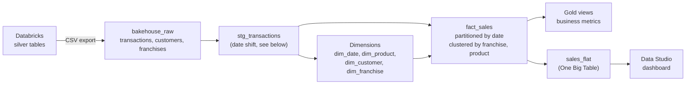
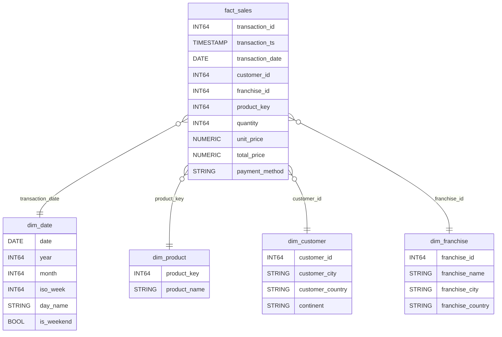
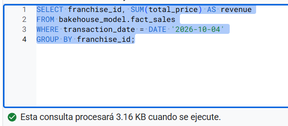
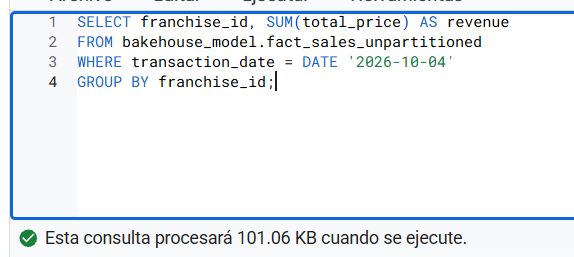
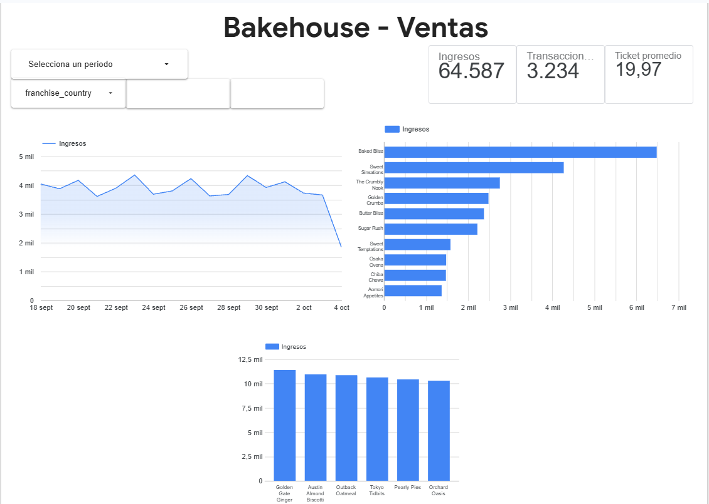
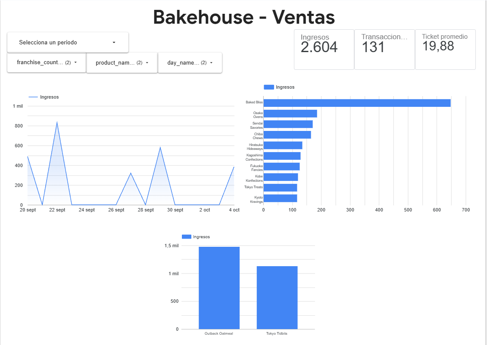
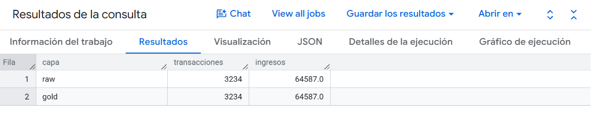

# BigQuery Star Schema — Bakehouse Sales

Dimensional model on **Google BigQuery** for the same business case as my [Databricks medallion pipeline](https://github.com/TU-USUARIO/databricks-medallion-bakehouse): bakery franchise sales, from cleaned transactions to a BI dashboard.

The goal of building the same use case on both platforms is to compare how each one solves it, and to apply BigQuery-specific concepts: **star schema modeling, partitioning, clustering, columnar cost, and BI-oriented serving layers**.

Built on the **BigQuery sandbox** (no billing account).

---

## Architecture



Three datasets, all in the same location (`US`):

| Dataset | Content |
|---|---|
| `bakehouse_raw` | Raw CSV loads from Databricks silver |
| `bakehouse_model` | Staging, dimensions and fact table |
| `bakehouse_gold` | Business views and the BI table |

---

## Star schema



- **Grain:** one row per transaction.
- **`dim_product`** uses a deterministic surrogate key (`FARM_FINGERPRINT`), stable across reloads.
- **`dim_date`** is generated with `GENERATE_DATE_ARRAY` + `UNNEST`: one row per day, including days without sales.
- **Money as `NUMERIC`**, not `FLOAT`, to avoid rounding errors in sums.

---

## Partitioning and clustering

`fact_sales` is **partitioned by `transaction_date`** and **clustered by `franchise_id, product_key`**, the columns most used for filtering and joining.

Benchmark: the same query (revenue by franchise for one day) on the partitioned table vs an identical unpartitioned copy.

| Table | Bytes processed |
|---|---|
| `fact_sales` (partitioned + clustered) | **3.16 KB** |
| `fact_sales_unpartitioned` | 101.06 KB |

**~97% fewer bytes processed (32×).** The ratio exceeds the expected 1/17 (one day out of 17) because the last day is a partial day, and because the partition column is used for pruning without being scanned row by row. Since BigQuery is columnar and bills by bytes read, this scales directly to cost at terabyte scale.

Lessons applied:
- Pruning requires a **constant filter** (literal, variable or query parameter). A filter that depends on a subquery in the `WHERE` clause may not prune.
- **Clustering** has little effect at this volume (a few thousand rows fit in a few blocks). It is configured for the expected access pattern, not to inflate the benchmark.
- **Dimensions are not partitioned or clustered:** they are small and have no natural filter date.




---

## Serving layer: star schema vs One Big Table

- **Gold views** (`daily_sales_by_franchise`, `product_performance`, `customer_metrics`) replicate the Databricks gold models on top of the star schema. They centralize metric definitions, for example average ticket as `SUM(revenue) / COUNT(*)`, never an average of averages.
- **`sales_by_weekday`** is a new view, only possible thanks to `dim_date`.
- **`sales_flat`** is a denormalized table (fact + all dimensions), partitioned and clustered, built for **Data Studio**. Data Studio has no semantic layer: each filter becomes a new query and multi-table relationships are limited, so a flat table allows filtering by any attribute without joins on every click. With a semantic-layer tool (Power BI, Looker/LookML), the star schema would be consumed directly.

The dashboard's date range control is bound to `transaction_date`, so date filters hit the partition column.




---

## Data reconciliation

Totals are reconciled between layers (raw vs gold) and between models (fact vs flat table): no rows lost or duplicated by joins. Dashboard totals match the Databricks project exactly.



---

## Sandbox constraint: date shift

In the BigQuery sandbox, partitions expire after 60 days, **calculated from the partition date, not the load date**, and older partitions expire immediately. The source data is from 2024, so a date-partitioned table would be emptied on creation.

`stg_transactions` shifts all dates forward by a constant offset so the latest day becomes "yesterday". Order and spacing between days are preserved, and the original date is kept in `original_transaction_date`. With billing enabled, this step would not be needed. The same expiration mechanism is used intentionally in production as a data retention policy.

---

## Databricks vs BigQuery: same case, two platforms

| Aspect | Databricks project | This project (BigQuery) |
|---|---|---|
| Ingestion | Auto Loader, incremental from a Volume | Batch CSV load (sandbox: no streaming) |
| Transformation | Lakeflow Declarative Pipelines | SQL scripts (`CREATE OR REPLACE ... AS SELECT`) |
| Gold modeling | Aggregated materialized views | Star schema + views + One Big Table |
| Data quality | Pipeline expectations | Reconciliation queries between layers |
| History | SCD Type 2 with `AUTO CDC` | Current customer version (from the SCD2) |
| Performance | Incremental refresh | Partitioning + clustering, measured in bytes |
| Consumption | AI/BI Dashboard + Genie | Data Studio |

---

## Repository structure

```
├── export/                       # queries run in Databricks to export silver data as CSV
│   ├── 01_transactions.sql
│   ├── 02_customers.sql
│   └── 03_franchises.sql
├── sql/                          # BigQuery scripts, run in order
│   ├── 00_staging.sql            # date shift (sandbox workaround)
│   ├── 01_dimensions.sql         # dim_franchise, dim_customer, dim_product, dim_date
│   ├── 02_fact_sales.sql         # partitioned and clustered fact table
│   ├── 03_gold_views.sql         # business views
│   ├── 04_sales_flat.sql         # One Big Table for BI
│   └── 05_partition_benchmark.sql
└── docs/                         # screenshots
```

## How to run

1. Run the `export/` queries in Databricks and download each result as CSV.
2. In BigQuery, create the datasets `bakehouse_raw`, `bakehouse_model` and `bakehouse_gold` (same location).
3. Load the CSVs into `bakehouse_raw` (schema auto-detection).
4. Run the `sql/` scripts in order.
5. Open `bakehouse_gold.sales_flat` in Data Studio to build the dashboard.

Data files are not versioned: the export queries are enough to reproduce the dataset.

---

## Known limitations and next steps

- Orchestrate the scripts with **Dataform** or scheduled queries (not available in the sandbox).
- Load customers as an SCD Type 2 dimension and join by validity period.
- Materialize gold views as tables or materialized views if query volume grows.
- Add automated data quality assertions instead of manual reconciliation.
